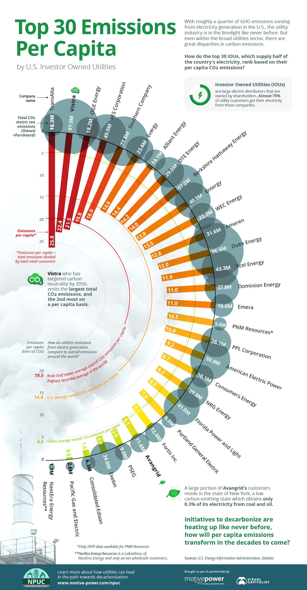

### Dataset

Si consideri la seguente visualizzazione presa dal sito [Visual Capitalism](https://www.visualcapitalist.com/emissions-per-capita-of-top-30-u-s-investor-owned-utilities/) che riporta le emissioni pro-capite delle maggiori aziende statunitensi produttrici di elettricità a proprietà privata (Investor-Ownend Utilities).




## Design

Riprogettare la visualizzazione in modo da risolvere i problemi evidenziati nell'analisi svolta durante l'esame.


Per la realizzazione è possibile utilizzare un file `.Rmd` oppure creare una App Shiny, come mostrato durante il corso.

È importante che l'Rmd o la App possano essere lanciate senza problemi con il pulsante *Run Document* o *Run App*.


```{r, include = FALSE}
library(tidyverse)
library(shiny)
library(magrittr)
library(patchwork)
library(pagedown)

```

```{r, echo = FALSE}
data <- read_csv('IOU_Emissions.csv', show_col_types = FALSE)
colnames(data) <- c('Ut', 'EpC', 'TE')

data %<>% mutate(Ut = as_factor(Ut),
                 EpC = as.double(EpC),
                 TE = as.double(TE))

```


### Soluzione 1:
Grafico che riporta le emissioni di CO2 delle maggiori aziende statunitensi produttrici di elettricità a proprietà privata, totali e pro-capite. 

```{r, echo = FALSE}
radioButtons(
  "ordina_per",
  "Tipo di ordine:",
  c(
    "Emiossioni pro-capite" = "EpC",
    "Emissioni totali" = "TE"
  )
)

```

```{r, echo = FALSE}
ordin_per <- reactive(input$ordina_per)

renderPlot({
  d_ord <- data %>% mutate(Ut = fct_reorder(Ut, data[[ordin_per()]]))
  
  gEpC <- ggplot(d_ord, aes(x = EpC, y = Ut)) +
    geom_col(fill = "coral4") +
    scale_x_reverse(labels = scales::label_number(suffix = "M")) +
    ggtitle("Emiossioni pro-capite") +
    xlab("CO2 all'anno") + ylab(NULL) +
    geom_text(aes(label = paste0(" ", format(EpC, nsmall = 2), "M "), # metto ", nsmall = 2" per essere coerente con quel che ho scritto all'esame "una cifra decimale in più potrebbe far fare un confronto", ma il csv si ferma al decimale che viene mostrato nel grafico originale, quindi con questi dati questa aggiunta non da niente in piu', e forzo una cifra in piu'
      color = EpC > mean(range(EpC))# non c'e' un vero motivo per usare mean(range()) piuttosto che avere tutte le etichette di uno stesso colore o altre soluzioni, ma e' solo per una minimal estetica
    ), hjust = "inward") +
    scale_color_manual(values = c("black", "white"), guide = "none") +
    theme_minimal() +
    theme(
      panel.grid.major.y = element_blank(),
      axis.text.y = element_blank(),
      plot.title = element_text(hjust = 0.5)
    )
  
  gTe <- ggplot(d_ord, aes(x = TE, y = Ut)) +
    geom_col(fill = "gray48") +
    scale_x_continuous(labels = scales::label_number(suffix = "M")) +
    ggtitle("Emissioni totali di CO2") +
    xlab("CO2") + ylab("Nome azienda:") +
    geom_text(aes(
      label = paste0(" ", TE, "M "),
      color = TE > mean(range(TE))# non c'e' un vero motivo per usare mean(range()) piuttosto che avere tutte le etichette di uno stesso colore o altre soluzioni, ma e' solo per una minimal estetica
    ),
    hjust = "inward") +
    scale_color_manual(values = c("black", "white"), guide = "none") +
    theme_minimal() +
    theme(
      panel.grid.major.y = element_blank(),
      axis.text.y = element_text(size = 10, hjust = 0.5),
      axis.title.y = element_text(angle = 0, margin = margin(r = -125)),
      plot.title = element_text(hjust = 0.5)
    )
  
  gEpC + gTe
}, width = "auto", height = 900)# imposto io queste dimensioni per chiarezza

```

#### Commento Grafico 1:
Secondo me così andrebbe mostrato il grafico, anche con il totale di emissioni, se no non renderebbe abbastanza, perché si farebbe un confronto alla pari ma non si vedrebbe effettivamente quante sono le emissioni totali. Ma se si volesse rispondere al solo comando "Emissioni pro-capite", quindi senza il totale, meglio il Grafico 2.

### Soluzione 2:
Grafico che riporta le emissioni pro-capite delle maggiori aziende statunitensi produttrici di elettricità a proprietà privata.
```{r, echo = FALSE}
checkboxInput("mediaUSA",
              "Visualizza l'emisione pro-capite media di CO2 delle 30 aziende",
              value = FALSE)

data_ord <- data %>% mutate(Ut = fct_reorder(Ut, desc(EpC))) #desc() per differenziare dal plot di prima

plotOutput("graf2",  click = "clickEpC")

clickedEpC <- reactiveVal({
  nearPoints(data_ord, NULL, maxpoints = 1, threshold = 20)
})

observeEvent(input$clickEpC, {
  clickedEpC(nearPoints(
    data_ord,
    input$clickEpC,
    maxpoints = 1,
    threshold = 20
  ))
})

output$graf2 <- renderPlot({
  media = mean(data_ord$EpC)
  
  p = ggplot(data_ord, aes(x = EpC, y = Ut)) +
    geom_point(size = 3) +
    geom_point(data = clickedEpC(), fill = "green") +
    geom_label(
      aes(label = paste0(format(EpC, nsmall = 2))),
      data = clickedEpC(),
      hjust = 1,
      color = "green"
    ) +
    ggtitle("Emissioni pro-capite") + xlab("Tonnellate di CO2 all'anno") + ylab("Nome azienda:") +
    theme_minimal() +
    scale_y_discrete(expand = c(0.01, 1)) +
    theme(
      axis.text.y = element_text(size = 10),
      axis.title.y = element_text(angle = 0, margin = margin(r = -70))
    )
  
  if (input$mediaUSA) {     #opzione aggiunta più che altro a scopo didattico 
    p = p + geom_vline(
      aes(xintercept = media),
      color = "red",
      linetype = 2,
      show.legend = FALSE
    ) +
      geom_text(aes(
        media,
        1,
        label = paste(round(media, 2), "  Media"),
        hjust = "center",
        vjust = "top"
      ))
  }
  
  p
})

```

#### Commento Grafico 2:
Essendo solo con i valori del pro-capita avere anche la media non sarebbe negativo, anche se non da molto al grafico, essendo facile farlo ad occhio.

### Commento Globale:
Da notare:<br>
    - come la singola cifra decimale per "CO2 totale" sia sufficiente;<br>
    - Le tre linee nel grafico originale, ovvero quella per il Golfo Arabo e per la media Globale e per quella degli USA sono poco chiare, non si capisce se si riferiscono a quelle private o in generale, inoltre le prime due medie citate (globali e Golfo Arabo) sono un po' fuori dal obbiettivo originale del grafico, di conseguenza, anche se sono più di impatto, essendo poco chiare non devono essere rappresentate nel grafico.
    Anche se sarebbero state citate nel "comando principale", e si riferissero alle emissioni pro-capite delle aziende produttrici di elettricità a proprietà privata, non è chiaro se sono le medie delle maggiori 30 aziende o no, e se non fossero le maggiori 30 aziende produttrici di elettricità a proprietà privata ci sarebbe un errore di consistensa (da "overall emissions" direi che sono le medie di tutte le aziende, anche non private), non potendo paragonare 30 aziende private a X aziende (X probablmente maggiore di 30).