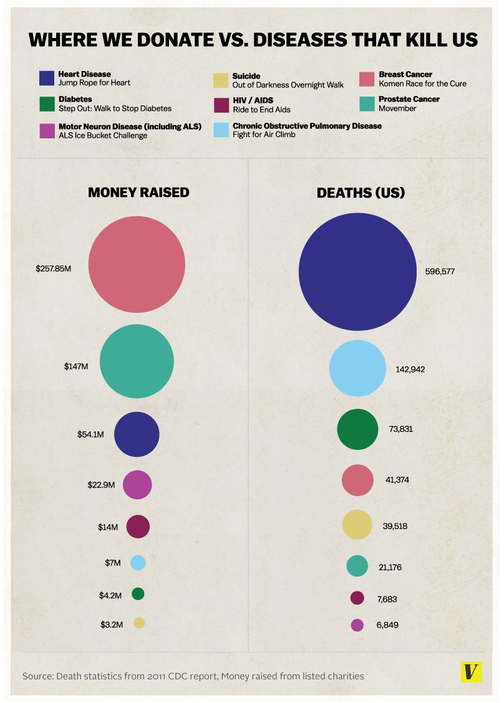

### Obiettivi

1. Analisi critica
2. Redesign

### Strumento

RStudio, e le librerie ritenute utili.

---

## Tema d'esame

Si consideri il seguente grafico preso da un [articolo di Vox (del 20 Agosto 2014)](http://www.vox.com/2014/8/20/6040435/als-ice-bucket-challenge-and-why-we-give-to-charity-donate).



L'articolo commenta il disallineamento tra l'attenzione mediatica con i relativi fondi raccolti pubblicamente e le cause di morte reali.

---

## Analisi

Analizzare il grafico sopra riportato secondo gli aspetti seguenti:

#### Question: c'è una domanda (o più di una) a cui la visualizzazione risponde? Scriverla con parole proprie.

> La domanda è relativamente chiara: riguarda l'allineamento tra i fondi raccolti con iniziative pubbliche mirate a combattere una data malattia e la corrispondente pericolosità o gravità misurata come numero di morti dovuti a tale malattia.

#### Data: i dati riportati sono validi e supportano la domanda? La qualità dei dati è appropriata? Indicare le caratteristiche non adeguate.

Caratteristica      | Valutazione dell'adequatezza
-------------------:|-------------------------------------------------
Accuracy            | SI: Le morti sono dati ufficiali i fondi arrivano da statistiche su enti no-profit registrati, che potrebbero non includere tutti i fondi
Completeness        | NO: non sono riportate tutte le cause di morte, presumibilmente solo le più comuni
Consistency         | SI: Le cause di morte sono le stesse nei due dati, tuttavia si tratta di malattie (disease) ma il suicidio non è a rigore una malattia
Currency            | SI: dati apparentemente da statistiche ufficiali dell'anno precedente
Credibility         | SI: I dati provengono da fonti ufficiali
Understandability   | SI: Il significato dei dati è chiaro
Precision           | SI: le cifre sui fondi riportano il primo decimale dopo il milione

> I dati supportano ragionevolmente la risposta alla domanda.
> 
> Ovviamente la gravità di una malattia non si misura solo dal numero di morti ma anche in base al costo sociale e alla riduzione della qualità della vita. Si tratta comunque di uno degli aspetti da considerare.
> 
> Inoltre di fronte ad un disallineamento è importante valutare se ad esempio elevati fondi (in particolare nel recente passato) abbiano migliorato la prevenzione e le cure portando ad un ridotto numero di morti.
> 
> Una possibile osservazione è che mentre si tratta di malattie, la voce "suicidi" non rappresenta una vera e propria malattia e potrebbe essere considerata un outlier.
> 
> Infine i fondi raccolti fanno apparentemente riferimento ad alcune iniziative, che però non sono necessariamente esaustive, quindi è probabile che i fondi raccolti globalmente, considerando anche iniziative non menzionate qui, possano alterare significativamente le proporzioni.

#### Visual Proportionality: le misure sono riportate in maniera uniformemente proporzionale?

> L'area delle bolle è uniformemente proporzionale alle misure che rappresenta.
>
> Tuttavia da un punto di vista visuale (secondo la legge di Stevens) il rapporto tra le aree viene percepito in maniera alterata. Perciò senza il sussidio delle etichette con i valori non saremmo in grado di valutare le relative proporzioni.

#### Visual Utility: tutti gli elementi presenti nel grafico trasmettono informazioni utili?

> Il diagramma è molto semplice e gli elementi riportati danno un contributo informativo.

#### Visual Clarity: i dati del grafico sono chiaramente identificabili e comprensibili (opportunamente descritti)?

> La codifica tramite colori quando i livelli della variabile sono più di 4 o 5 rende difficile discriminare accuratamente i colori. In particolare l'ordinamento della legenda appare casuale e non segue alcun criterio apparente.
>
> Inoltre la legenda separata comporta un movimento degli occhi avanti e indietro tra le bolle e la legenda che rende faticosa la lettura.

## Design

Riprogettare la visualizzazione in modo da risolvere i problemi evidenziati nell'analisi.

```{r import delle librerie,include=FALSE}
library(tidyverse)
library(shiny)
library(patchwork)
library(ggrepel)
```

### Soluzione 1: diagrammi a barre affiancati

Una prima soluzione consite in una coppia di diagrammi a barre affiancati. Le malattie possono essere ordinate in base ai fondi raccolti o al numero di morti.

```{r load data, fig.width=6, fig.height=3, echo=FALSE}
d <- read_csv('fundraising4disease.csv', col_type = cols(
                  Disease = col_factor(),
                  Money = col_double(),
                  Deaths = col_double()
      )) %>% mutate(DpD = Money/Deaths*1e6)
```

```{r, echo=FALSE}
sort_orders <- c("Deaths","Money")
radioButtons("sort_order", "Evaluation",sort_orders)
```

```{r, fig.width=6, fig.height=3, echo=FALSE}
sort_order <- reactive(input$sort_order)

renderPlot({
d_sorted <- d %>% mutate(Disease = fct_reorder(Disease,d[[sort_order()]]))

pd <- ggplot(d_sorted,aes(x=Deaths,y=Disease))+
      geom_col()+
      scale_x_reverse(labels=scales::label_number_si())+
      ylab(NULL)+ggtitle("Deaths")+
      geom_text(aes(label=paste0(" ",format(as.integer(Deaths),big.mark=" ",
                                 prefix=" ",suffix=" ")," "),
                    color=Deaths>mean(range(Deaths))),
                hjust="inward")+
      scale_color_manual(values=c("black","white"),guide="none")+
      theme_minimal()+
      theme(panel.grid.major.y = element_blank(),
            axis.text.y = element_blank())

pm <- ggplot(d_sorted,aes(x=Money,y=Disease))+
      geom_col(fill="seagreen")+
      geom_text(aes(label=paste0(" $",Money,"M "),color=Money>mean(range(Money))),
                hjust="inward")+
      scale_color_manual(values=c("black","white"),guide="none")+
      ggtitle("Fundings")+
      scale_x_continuous(labels=scales::label_dollar(prefix = '$',suffix="M"))+
      theme_minimal()+
      theme(panel.grid.major.y = element_blank(),
            axis.text.y = element_text(hjust=0.5),
            axis.title.y = element_text(angle=0,margin = margin(r=-60)))
pd+pm
})
```


---

### Soluzione 2: slopegraph

Una seconda soluzione consiste in uno slopegraph (diagramma a pendenza).
Viste le distribuzioni molto allungate è possibile utilizzare sui due assi verticali una scala logaritmica, oppure usare il ranking invece dei valori assoluti.


```{r, echo=FALSE}
slope_scales <- c("Linear","Log","Rank")
radioButtons("slope_scale", "Tipo di scala",slope_scales)
```


```{r, fig.width=8,fig.height=6, echo=FALSE}
plotOutput("slope",width=800,height=600)

m_to_d <- function(m){
  (m-min(d$Money))/(max(d$Money)-min(d$Money))*(max(d$Deaths)-min(d$Deaths))+min(d$Deaths)
}
d_to_m <- function(m){
  (m-min(d$Deaths))/(max(d$Deaths)-min(d$Deaths))*(max(d$Money)-min(d$Money))+min(d$Money)
}
slope_scale <- reactive(input$slope_scale)

output$slope <- renderPlot({
  if(slope_scale()=="Rank"){
    d %>% pivot_longer(c("Deaths","Money"),names_to="Aspect") %>% 
      group_by(Aspect) %>% 
      mutate(Rank = rank(-value)) %>% 
    ggplot(aes(x=Aspect,y=Rank,group=Disease,color=Disease))+
      geom_line()+
      geom_point()+
      scale_y_reverse(breaks=1:8, minor_breaks=NULL)+
      scale_color_brewer(type="qual",guide="none",palette=2)+
      geom_text(aes(label=paste0(Disease,"\n",
                                 if_else(Aspect=="Deaths",format(as.integer(value),big.mark = " "),
                                                          paste0("$",value,"M")))),
                hjust="outward",show.legend = FALSE)+
      theme_minimal()
  }else{
    p <- 
    ggplot(d,aes(color=Disease))+
      geom_point(aes(y=Deaths,x="Deaths"))+
      geom_point(aes(y=m_to_d(Money),x="Fundings"))+
      geom_segment(aes(y=Deaths,x="Deaths",yend=m_to_d(Money),xend="Fundings"))+
      scale_x_discrete(name=NULL,expand=expansion(mult=0.5))+
      scale_color_brewer(type="qual",guide="none",palette=2)+
      geom_text_repel(aes(y=Deaths,x="Deaths",
                          label=paste0(Disease,"\n",format(Deaths,big.mark=" "))),
                      direction = "both",xlim = c(-3,1),size=3,show.legend = FALSE)+
      geom_text_repel(aes(y=m_to_d(Money),x="Fundings",label=paste0(Disease,"\n$",Money,"M")),
                      direction = "both",xlim = c(2,5),size=3,show.legend = FALSE)+
      theme_minimal()
      if(slope_scale()=="Log"){
         p +  scale_y_log10(labels=scales::label_number_si(),
                           sec.axis = sec_axis(d_to_m, name="Fundings",
                                               labels=scales::label_dollar(suffix="M")))
      }else{
          p+scale_y_continuous(labels=scales::label_number_si(),
                           sec.axis = sec_axis(d_to_m,name="Fundings",
                                               labels=scales::label_dollar(suffix="M")),
                           expand=expansion(add=c(5e4,1000)))
      }
    }
})
```

---

### Soluzione 3: scatter plot


Terza variante: uno scatter plot di donazioni contro decessi con una linea di riferimento che riporta la media delle donazioni per decesso e interazione tramite hover per i dettagli.

```{r scatter plot out,echo=FALSE}
plotOutput("scatter", hover= hoverOpts(id="h",delayType="debounce",delay=100),width=800,height=800)

min_d = min(d$Deaths)
max_d = max(d$Deaths)
min_m = min(d$Money)
max_m = max(d$Money)
slope = sum(d$Money)/sum(d$Deaths)
avg_df = data.frame(Money=c(min_m,max_d*slope),
                    Deaths=c(min_m/slope,max_d))

hovered = reactiveVal(NULL)
observeEvent(input$h,{
  hovered( nearPoints(d, input$h, threshold = 10) )
})
output$scatter <- renderPlot({
  p<-ggplot(d,aes(y=Money,x=Deaths))+
  geom_point()+
  scale_y_log10(labels=scales::label_dollar(prefix = '$',suffix="M"))+
  scale_x_log10(labels=scales::label_number_si())+
  geom_line(data=avg_df,color="darkorange",linetype=3)+
  annotate(geom="text",x=sqrt(max_d*min_d),y=sqrt(max_m*min_m), 
           label=paste0("Average donation $",round(slope*1e6,0), " per death"), 
           color="darkorange",angle=45)+
  theme_minimal()
  if(! is.null(hovered()) && dim(hovered())[1]>0){
    p<-p+geom_text(aes(label=paste0("\n  ",Disease,"  \n  ($",round(DpD,0)," per death)")), 
                   data=hovered(),vjust="inward",hjust="inward")+
        geom_point(data=hovered(), size=3,color="tomato")+
        geom_segment(aes(xend=min_d,yend=Money),data=hovered(),color="tomato",linetype=2)+
        geom_segment(aes(yend=min_m,xend=Deaths),data=hovered(),color="tomato",linetype=2)+
        geom_text(aes(label=paste0("$",Money,"M"),x=min_d),data=hovered(), vjust="bottom", hjust="right", color="tomato",size=3, nudge_y = 0.02)+
        geom_text(aes(label=paste0("  ",Deaths,""),y=min_m),data=hovered(), vjust="top", hjust="left", color="tomato",size=3)
  }
  p
})
```
